# Adwait-NAS

A home Network Application Server built on an old HP laptop with [OpenMediaVault](https://www.openmediavault.org/) (OMV), with users and permissions designed around least privilege and secure remote access over [Tailscale](https://tailscale.com/).

I'm a cybersecurity student and I built this to learn identity and access management (IAM) on a real system instead of only reading about it. This README documents the whole process in order, so you can follow it and build your own. It is a learning project, not a production setup, and I'll keep extending it (see [What's next](#whats-next)).

All screenshots are from my real setup. Sensitive details (login links, account emails, my tailnet name, drive serial numbers and internal IDs) are blacked out.

## At a glance

| | |
|---|---|
| Hostname | `adwait-nas` |
| OS | OpenMediaVault 8 (based on Debian 13) |
| Hardware | HP laptop, Intel Core i5-1137G5, 8 GB RAM, 1 TB NVMe SSD (operating system) |
| Data storage | 57 GB USB flash drive, ext4, mounted in OMV |
| File sharing | SMB/CIFS, login required, no public shares |
| Remote access | Tailscale, installed on the NAS itself, no port forwarding |
| Managed from | OMV web interface, from another computer |
| Built | September 2026 (Tailscale added 4 October 2026) |

## How it fits together

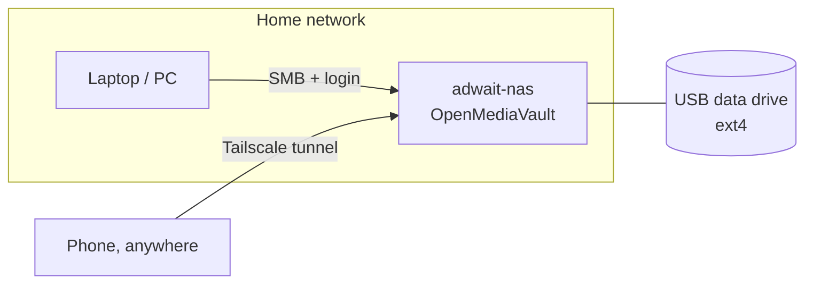

The NAS sits on my home network and is never exposed to the internet. At home I reach it directly. Away from home I reach it through Tailscale, which only lets in devices signed in to my own account.

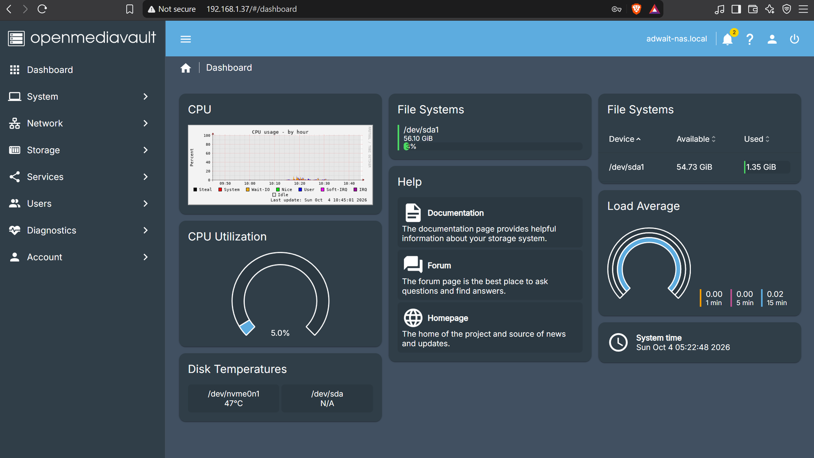
*The OMV dashboard, managed from another computer in a browser.*

## Contents

1. [Goals](#1-goals)
2. [What you need](#2-what-you-need)
3. [Make the installer USB and set up the BIOS](#3-make-the-installer-usb-and-set-up-the-bios)
4. [Install OpenMediaVault](#4-install-openmediavault)
5. [First login and basic hardening](#5-first-login-and-basic-hardening)
6. [Storage](#6-storage)
7. [Design the access model](#7-design-the-access-model)
8. [Create users, groups and shared folders](#8-create-users-groups-and-shared-folders)
9. [Turn on SMB sharing](#9-turn-on-smb-sharing)
10. [Test the access controls](#10-test-the-access-controls)
11. [Remote access with Tailscale](#11-remote-access-with-tailscale)
12. [Troubleshooting](#12-troubleshooting)
13. [What I learned](#13-what-i-learned)
14. [Limitations](#14-limitations)
15. [What's next](#whats-next)

---

## 1. Goals

- Install OMV on a spare laptop from a USB drive.
- Give the NAS a stable address on my home network.
- Create users and groups with least-privilege access.
- Prove the permissions work, including the cases that should be denied.
- Reach the NAS from outside my home without opening any ports.

**Why OpenMediaVault?** It is free and open source, built on Debian (so the skills carry over to normal Linux), managed entirely from a web page, and extendable with plugins.

**Why a laptop?** I already had one. It also has its own screen, keyboard and battery, which makes troubleshooting much easier than on a headless box.

## 2. What you need

- A computer to turn into the NAS (anything reasonably modern works; OMV is light)
- A second computer to download the ISO, write the USB and open the OMV web page
- A USB flash drive (8 GB or bigger) for the installer. It will be erased.
- A second USB drive or disk for data, if you want to keep data separate from the operating system, as I did
- Ethernet cable (wired is much easier than Wi-Fi for OMV)
- [Rufus](https://rufus.ie/) on the second computer if it runs Windows
- The OMV ISO from the [official site](https://www.openmediavault.org/download.html), not a random mirror

The installer **wipes the disk it installs to**, so back up anything you need from the machine first.

## 3. Make the installer USB and set up the BIOS

**Write the USB in Rufus:**

1. Plug in the USB drive and open Rufus.
2. Under Device, pick the USB drive. Double-check the drive, because it gets erased.
3. Click SELECT and choose the OMV ISO.
4. Partition scheme: GPT. Target system: UEFI (non-CSM), as this laptop is a modern UEFI machine.
5. Click START and use ISO Image mode (the default). If the machine won't boot from the USB, try writing it again in DD Image mode.

**Change BIOS settings on the NAS machine:**

| Setting | What I did |
|---|---|
| Secure Boot | Disabled |
| Legacy / CSM | Left off |
| Boot device | Chose the USB from the boot menu (F9 on this HP) |

*Why I turned Secure Boot off:* OMV is a Debian-based appliance and the installer image may not boot with Secure Boot on. The cost is real: with it off, nothing verifies the bootloader. I accepted that because the machine stays at home, isn't used for browsing or email, and isn't near untrusted people. If you can boot with it on, leave it on.

## 4. Install OpenMediaVault

1. Plug in the USB, power on, and open the boot menu to choose the USB drive.
2. Choose **Install** at the OMV menu.
3. Go through the text installer:
   - Language, country, keyboard: English, India
   - Hostname: `adwait-nas`
   - Domain: left blank
   - Root password: strong and unique, kept in a password manager
   - Time zone: Asia/Kolkata
   - Disk: the 1 TB internal SSD, which holds only the operating system
4. When it finishes, remove the USB and reboot.
5. The machine now shows a console login for `adwait-nas`.

## 5. First login and basic hardening

From the second computer on the same network, open the NAS in a browser using either `http://adwait-nas.local` or its IP address (shown on the console or in the router's device list).

1. Sign in to the web interface with the default administrator login from the official OMV documentation.
2. **Change the admin password immediately.** Default credentials are an easy way to get compromised.
3. Run all updates under **System → Update Management**.
4. Check the OMV version on the **Dashboard**.

**Give the NAS a fixed address.** A NAS is only useful if its address stays the same. I recommend a DHCP reservation on the router (bind the NAS's MAC address to one IP). This keeps all addressing in one place. A static IP set in OMV under Network → Interfaces also works.

**Keep services to a minimum.** Every running service is another way in, so I only enable what I use. Nothing is port-forwarded on the router.

## 6. Storage

I kept the operating system and my data on separate devices:

- **Internal 1 TB SSD:** operating system only
- **USB flash drive (57 GB):** data (storage issue faced due to incompetance)

To use a drive for shared data in OMV:

1. **Storage → Disks:** confirm OMV sees the drive.
2. **Storage → File Systems:** create an ext4 file system on it and mount it.
3. Wait for the status to show **Available**.

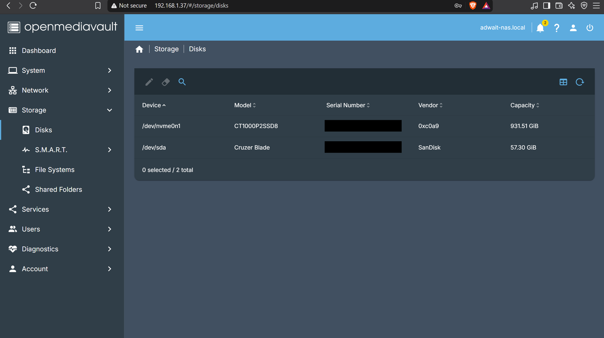
*Storage → Disks: the 1 TB internal SSD and the 57 GB USB drive. Serial numbers are blacked out.*

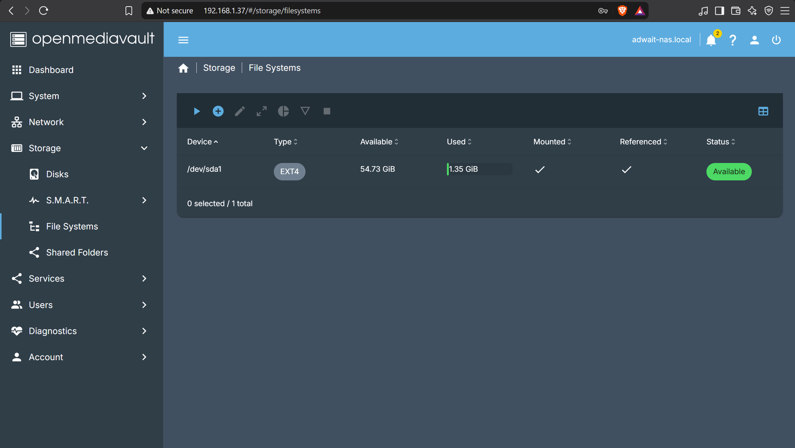
*Storage → File Systems: the data drive formatted as ext4, mounted and available.*

Keeping data off the system disk makes it easier to move or back up the data later, and it keeps a data mistake from affecting the OS. A USB flash drive is fine for a learning project, but it is not durable storage (see [Limitations](#14-limitations)).

## 7. Design the access model

IAM comes down to three questions:

- **Who are you?** (authentication)
- **What are you allowed to do?** (authorization)
- **What did you do?** (auditing)

I designed the rules **before** touching the OMV interface, which made the setup much faster. The principles:

- **Least privilege.** Everyone gets only the access they need.
- **Groups, not per-user rules.** Give permissions to a group and add people to the group.
- **Separate admin from daily use.** The built-in web admin account only manages the NAS. I use a different account for my files.
- **One account per person.** No shared logins, so activity can be traced.
- **Deny by default.** Nothing is public. If someone isn't granted access, they don't get in.

**Groups**

| Group | Members | Purpose |
|---|---|---|
| Family | adwait, Guest2 | Household members who share family files |
| Guests | Guest1 | Visitors who only need to read |

**Shared folders and who can access them**

| Folder | Purpose | adwait | Family group | Guests group |
|---|---|---|---|---|
| `Media-family` | Photos, videos and shared files | Read/Write | Read/Write | Read-only |
| `documents-adwait` | My private documents | Read/Write | No access | No access |
| `backups` | Backups from my devices | Read/Write | No access | No access |

## 8. Create users, groups and shared folders

In the OMV web interface:

1. **Users → Groups:** create `Family` and `Guests`.
2. **Users → Users:** create each user with a strong, unique password and the right group. Keep passwords in a password manager.
3. **Storage → Shared Folders:** create `Media-family`, `documents-adwait` and `backups` on the data drive.
4. For each shared folder, open **Permissions** and set the privileges for each user and group to match the table in step 7. Choose Read/Write, Read-only or No access explicitly. Don't leave anything on a default you haven't checked.
5. Apply the pending changes with the banner at the top of the interface. OMV does not apply changes until you do.

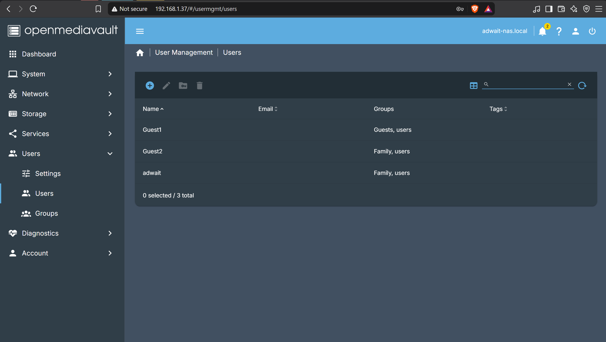
*Users → Users: three accounts, each with its group.*

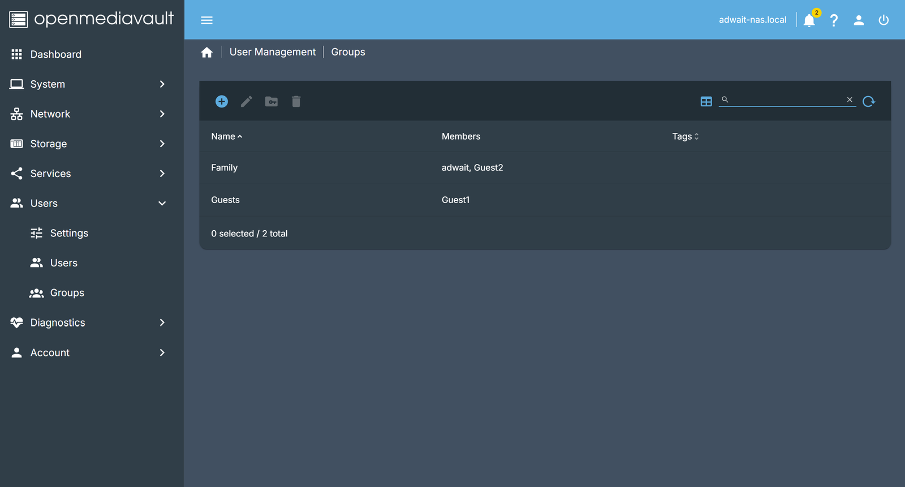
*Users → Groups: Family and Guests, with their members.*

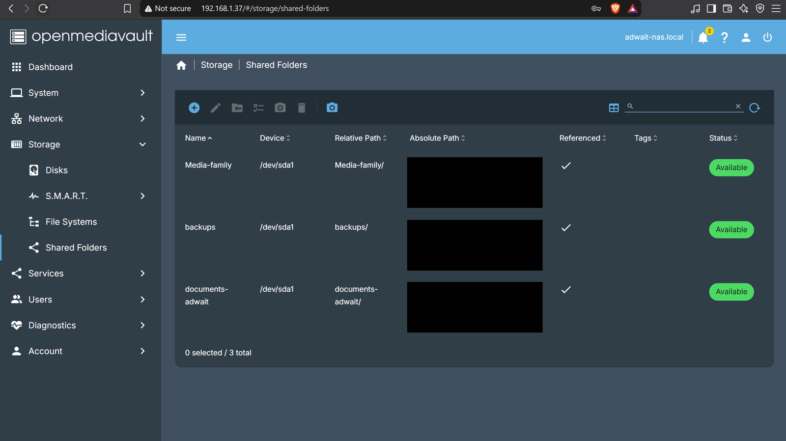
*Storage → Shared Folders: the three folders on the data drive. The absolute paths are blacked out because they contain the drive's unique ID.*

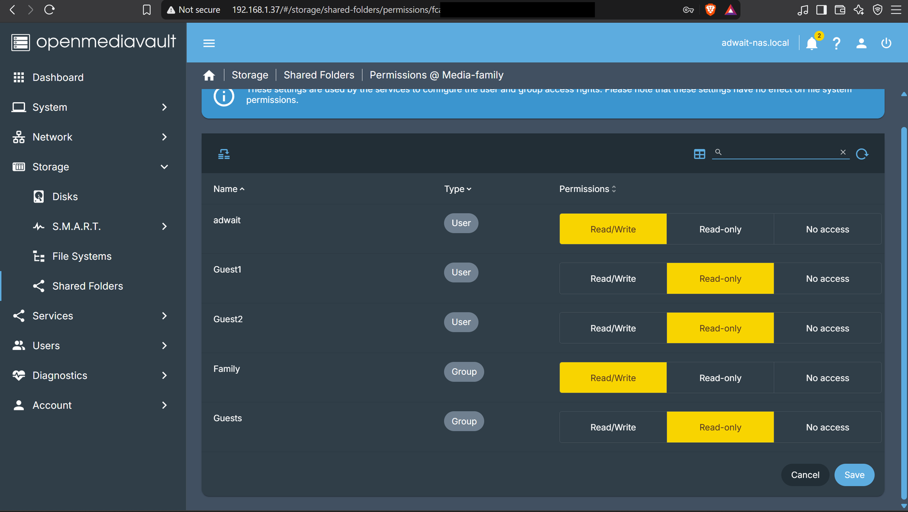
*Permissions for `Media-family`: adwait and the Family group have Read/Write, and the Guests group is Read-only. OMV lists users and groups separately, so Guest1 and Guest2 also have their own entries here (both Read-only). Test 3 below checks which rule wins for Guest2, who is in the Family group.*

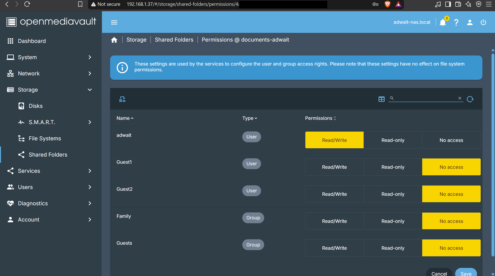
*Permissions for `documents-adwait`: only adwait has Read/Write. Everyone else is set to No access.*

## 9. Turn on SMB sharing

1. **Services → SMB/CIFS → Settings:** tick **Enabled**. I left home directories (and the home-directory recycle bin) and the time server off.
2. **Services → SMB/CIFS → Shares:** add each shared folder and set **Public = No**, so a login is always required.
3. Apply the pending changes.

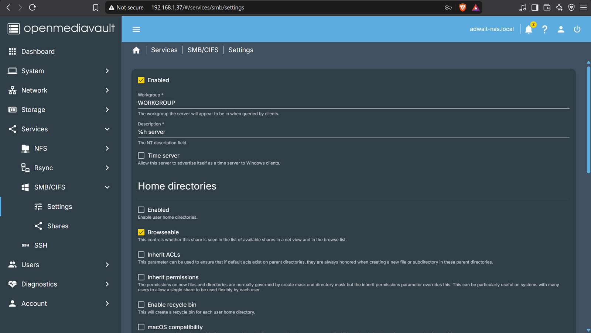
*Services → SMB/CIFS → Settings: SMB enabled, home directories off.*

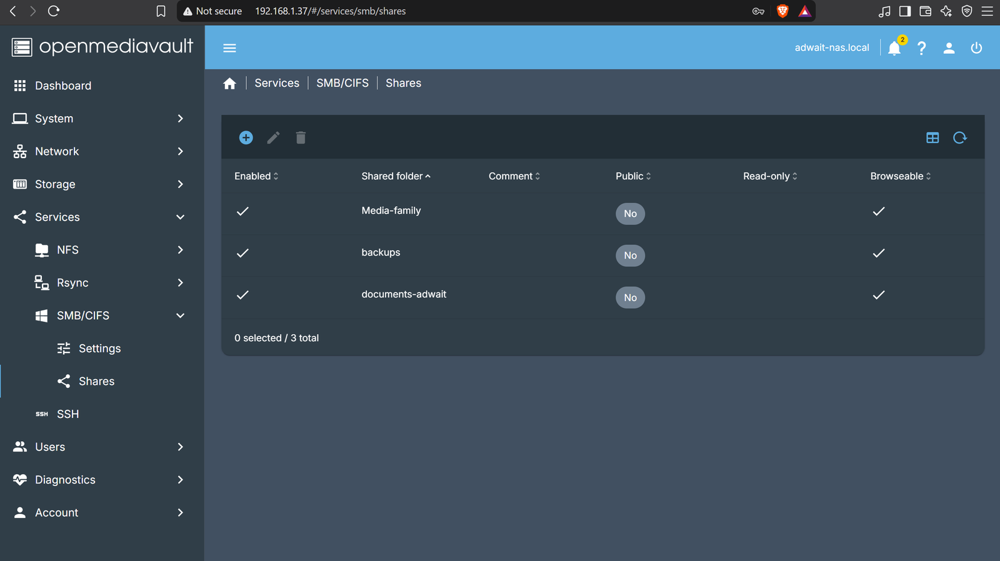
*Services → SMB/CIFS → Shares: all three folders shared with Public = No, so a login is always required.*

Note that OMV's folder privileges control what the file-sharing services allow. They are separate from the Linux file system permissions, so check both if something behaves unexpectedly.

## 10. Test the access controls

Creating users isn't enough. I check that each account can do what it should and can't do what it shouldn't. **The denied cases matter most.**

**How to test from Windows:** connect to the NAS and sign in as each user in turn.

- File Explorer: `\\adwait-nas\Media-family` (or use the IP address)
- Or in a terminal: `net use Z: \\adwait-nas\Media-family /user:Guest1`

Windows caches credentials, so clear connections between tests with `net use * /delete`.

**Test plan and what should happen:**

| # | Test | Expected |
|---|---|---|
| 1 | adwait opens `Media-family` and creates a file | Allowed |
| 2 | adwait edits a file in `documents-adwait` | Allowed |
| 3 | Guest2 (Family group) creates a file in `Media-family` | Allowed by the Family group rule, but Guest2 also has its own Read-only entry. This test shows which rule wins. |
| 4 | Guest2 opens `documents-adwait` | Denied |
| 5 | Guest2 opens `backups` | Denied |
| 6 | Guest1 (Guests group) reads a file in `Media-family` | Allowed |
| 7 | Guest1 tries to create or delete a file in `Media-family` | Denied |
| 8 | Guest1 opens `documents-adwait` | Denied |
| 9 | Connect with a wrong password | Denied |
| 10 | Connect with no credentials | Denied |
| 11 | Sign in to the OMV web interface as a non-admin user | Denied |
| 12 | Sign in to the OMV web interface with the old default admin password | Fails |

**Auditing.** Two places show what is happening:

- **Diagnostics → Services → SMB/CIFS** lists active sessions: which user, from which machine, to which share, and since when. In my setup it shows user `adwait` connected over SMB 3.1.1 to `Media-family`.
- **Diagnostics → System Logs** shows failed login attempts, which is how you confirm tests 9 and 10 were actually rejected.

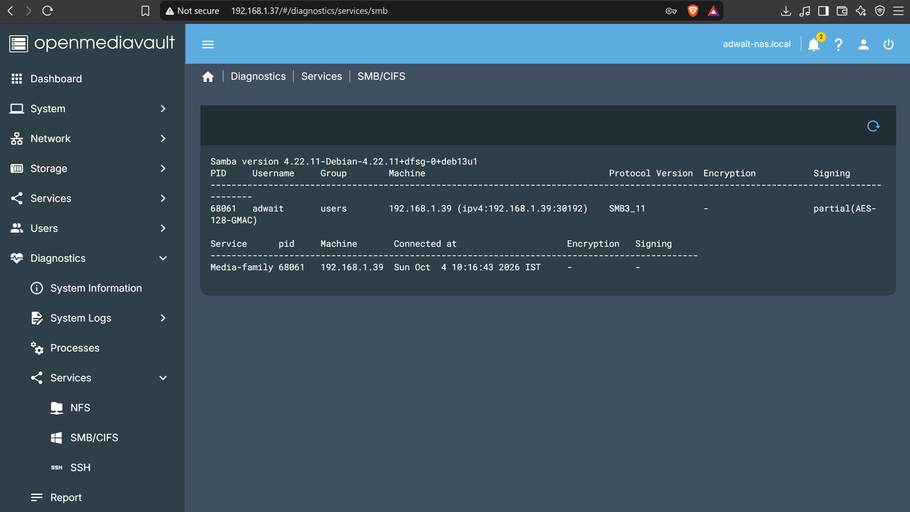
*Diagnostics → Services → SMB/CIFS: user `adwait` connected from a laptop on the home network over SMB 3.1.1. The address shown is a private LAN address.*

## 11. Remote access with Tailscale

I wanted access from outside my home without opening any ports on the router. Tailscale builds a private, encrypted network (a "tailnet") between my own devices:

- The NAS only makes outbound connections, so nothing is exposed to the internet.
- A device has to be signed in to my account before it can join.
- Traffic between devices is encrypted.
- It's free for personal use.

**Setup on the NAS** (installed directly on the OMV host, not in a container):

```bash
curl -fsSL https://tailscale.com/install.sh | sh   # official install script
tailscale up                                       # prints a one-time login link
```

Open the login link on another device and sign in.

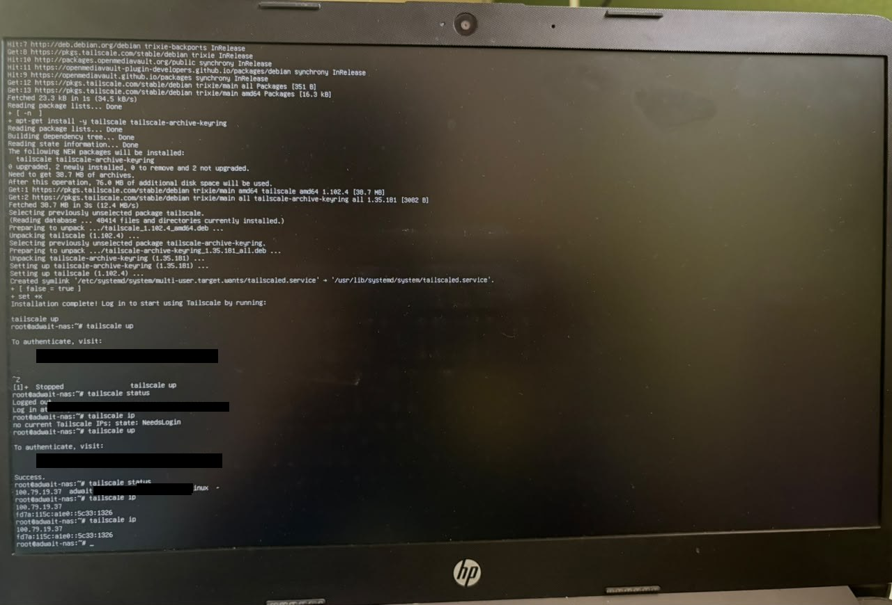
*Installing Tailscale on the NAS console. The one-time login links and my account email are blacked out.*

The link is single-use and tied to your account, so don't share it or paste it into a public repo or screenshot. If you interrupt the sign-in, `tailscale status` will show the node as logged out; just run `tailscale up` again for a fresh link.

Then verify:

```bash
tailscale status    # the NAS should be listed
tailscale ip        # shows its Tailscale addresses
```

Install the Tailscale app on your phone or laptop, sign in with the same account, and the device list in the Tailscale admin console should show both machines as connected. My setup runs Tailscale 1.102.4 with the NAS (Linux) and my iPhone on the tailnet. From the phone on mobile data, the app shows the NAS as connected.

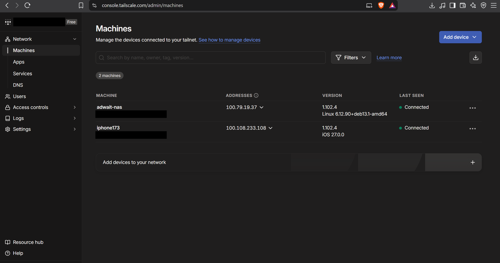
*Tailscale admin console → Machines: the NAS and my iPhone, both connected. My account name and email are blacked out.*

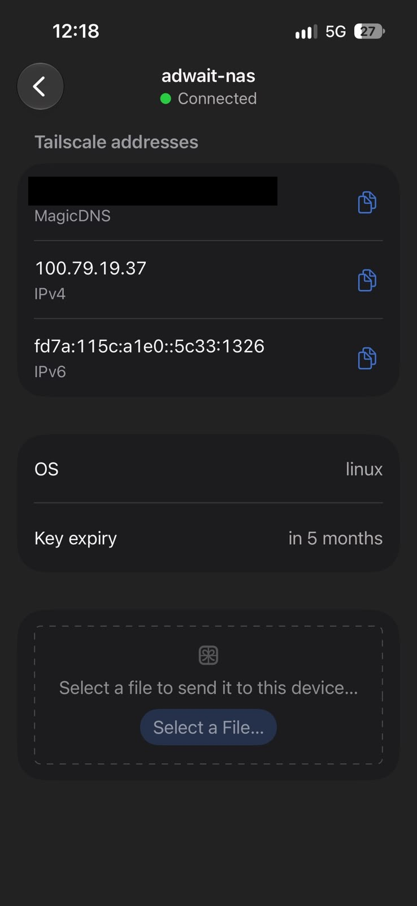
*The Tailscale app on my phone, on mobile data (5G), showing the NAS as connected. The MagicDNS name is blacked out because it contains my tailnet ID.*

**Security notes for this step:**

- Tailscale only gets a device onto the network. The SMB logins, groups and folder permissions from step 8 still apply. Shares are still not public.
- Whoever controls your Tailscale account controls which devices can join, so use a strong password and two-factor authentication on it.
- **Device keys expire by default** (mine is set to expire in about 5 months). When a key expires the device drops off the tailnet until it is re-authenticated. Either plan to renew it, or deliberately disable expiry for a server after thinking about the trade-off.
- Keep secrets out of anything you publish. Mask login links, auth keys, account emails and your tailnet name in screenshots.

## 12. Troubleshooting

| Problem | Likely cause | Fix |
|---|---|---|
| Laptop won't boot from the USB | Secure Boot on, wrong boot order, or a bad write | Turn off Secure Boot, use the boot menu, or rewrite the USB in DD Image mode |
| Installer can't find the network | Cable unplugged or missing driver | Use Ethernet, check the router, or try a USB Ethernet adapter |
| `adwait-nas.local` doesn't open | mDNS isn't working on that computer | Use the NAS's IP address from the router |
| NAS IP address changes | DHCP lease changed | Make a DHCP reservation, or set a static IP |
| Changes don't take effect in OMV | Pending changes not applied | Click the apply banner at the top of the interface |
| A user sees a folder they shouldn't | Share is public or privileges too broad | Set Public = No and recheck the permission table |
| Can't reach the web UI after a network change | Bad network settings | Log in on the NAS console and run `omv-firstaid` |
| Tailscale shows the NAS as logged out | Sign-in wasn't completed | Run `tailscale up` again and finish the login |
| NAS disappears from the tailnet after months | Device key expired | Re-authenticate the device, or review the key-expiry setting |

**A real problem I hit:** Windows refused a second connection to the same server with the error *"multiple connections to a server or shared resource by the same user, using more than one user name, are not allowed"*. Windows had cached the first login and tried to reuse it for the next share. The fix is to clear cached connections before connecting as a different user:

```
net use * /delete
```

I now run this between every test with a different account.

**Useful commands on the NAS:**

```bash
omv-firstaid            # menu to reset the web admin password or network settings
ip a                    # show network addresses
systemctl status smbd   # check the SMB service
journalctl -u smbd      # SMB logs
tailscale status        # Tailscale connection state
```

## 13. What I learned

- Authentication proves who you are, authorization decides what you can touch, and auditing records what happened. A proper setup needs all three.
- Plan the permission matrix first. Configuring OMV took far less time once the decisions were already on paper.
- Groups are much easier to manage than per-user permissions.
- Start with no access and add only what's needed.
- The admin account shouldn't be the one used every day.
- Test the denied cases, not just the allowed ones.
- Every enabled service is another way in, so only enable what you need.
- A VPN moves the trust to your account, so the account's security (strong password, 2FA) becomes critical.
- Defaults matter: default passwords, and defaults like key expiry, can quietly cause problems.
- Screenshots and logs can leak things (emails, login links, network IDs). Review them before publishing.

## 14. Limitations

This is a home lab, not a production setup.

- **No redundancy.** The data lives on a single USB flash drive, so one failure loses it. Flash drives are also not designed for heavy, long-term use.
- **No backup of the NAS itself yet.**
- **Tailscale access rules are still default.** Every device on my tailnet can reach every other one. That's fine with two devices of my own, but should be restricted before adding more.
- **SMB traffic isn't encrypted on the local network.** My session shows SMB signing but no SMB-level encryption. Over Tailscale it's encrypted by the tunnel, but at home it isn't.
- **The OMV web interface uses plain HTTP on my local network** (the browser shows "Not secure"). Only devices on my home network or my tailnet can reach it, but HTTPS would be better.
- **Secure Boot is off** (see step 3).

## What's next

I'm still learning, and I'll add these to this repo as I build and understand them:

- **Docker** on the NAS, to run self-hosted services in containers
- **Offsite backups**, so the data survives losing both the drive and my home

---

*No passwords, keys, login links or account details are stored in this repository. The IP addresses shown are private LAN addresses, and sensitive details in screenshots are blacked out.*
